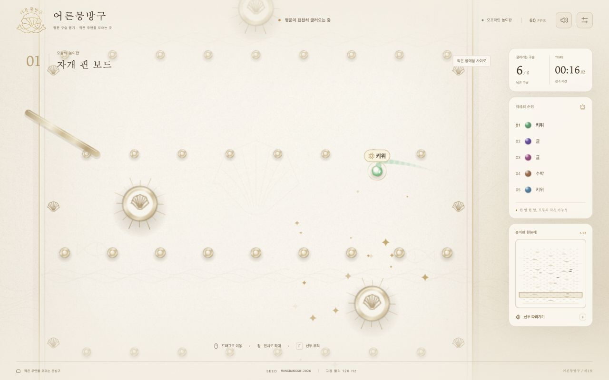

<p align="center">
  
</p>

<h1 align="center">어른뭉방구 · 행운 구슬 뽑기</h1>
<p align="center">
  <a href="https://prestige-kim.github.io/moonbangoo_PinBall/"><strong>게임 시작하기 →</strong></a>
</p>

| 대기 화면 | 게임 진행 |
| :---: | :---: |
|  |  |

## 핵심 기능

- **간편한 참가자 입력** — 쉼표·줄바꿈으로 이름을 입력하고, `이름*3`으로 구슬 수를 지정합니다.
- **4가지 추첨 방식** — 1등, 꼴등, N번째, 상위 N명을 선택합니다.
- **3가지 코스 · 4가지 재질** — 자개 핀 보드, 금박 회전길, 행운 갈림길에 종이·홀로그램·금박·은박을 조합합니다.
- **유리 대포로 출발 섞기** — 투명 대포 안에서 구슬들이 충돌하며 자리를 바꾸고, 셔플 결과에 따라 무작위 출발 슬롯으로 발사합니다. 기본 설정에서는 경기마다 새 시드를 사용합니다.
- **이어지는 카메라 연출** — 바퀴가 조립된 대포에서 오른쪽의 실제 놀이판으로 구슬을 쏘고, 카메라가 구슬을 따라 판 안으로 들어갑니다. 경기에서는 선두와 실시간 순위를 추적합니다.
- **결과 확인과 재시작** — 당첨자·최종 순위·시드를 확인하고 같은 멤버로 다시 진행합니다.
- **화면과 속도 조절** — 모바일 터치·핀치, 게임 속도, 효과음, 화질과 화면 효과 줄이기를 지원합니다.

## 이용 방법

1. **시작하기**를 누르고 참가자 이름을 입력합니다. 예: `수박*2,키위*2,귤*2`
2. 설정창에서 추첨 방식·코스·재질을 고른 뒤 **게임 시작**을 누릅니다.
3. 유리 대포에서 구슬이 섞여 발사되면 경기가 자동으로 시작됩니다. 완주 후 결과를 확인합니다.

시드를 비워 두면 재시작할 때도 새로 섞습니다. 세부 설정에 시드를 직접 입력하면 같은 참가자·물리 설정에서 출발 배치와 결과를 재현합니다.

설치 없이 [브라우저에서 바로 실행](https://prestige-kim.github.io/moonbangoo_PinBall/)할 수 있습니다. PC에서는 내려받은 폴더의 `index.html`을 열어 오프라인으로도 이용할 수 있습니다.

<details>
<summary>개발 및 검증</summary>

HTML · CSS · JavaScript · Canvas 2D로 구현한 정적 웹 앱입니다. 외부 라이브러리나 빌드 과정이 필요하지 않습니다.

```sh
node --test tests/*.test.cjs
```

검증 범위는 [QA.md](./QA.md)를 참고해 주세요. GitHub Pages는 `main` 브랜치의 루트(`/`)를 배포합니다.

</details>
