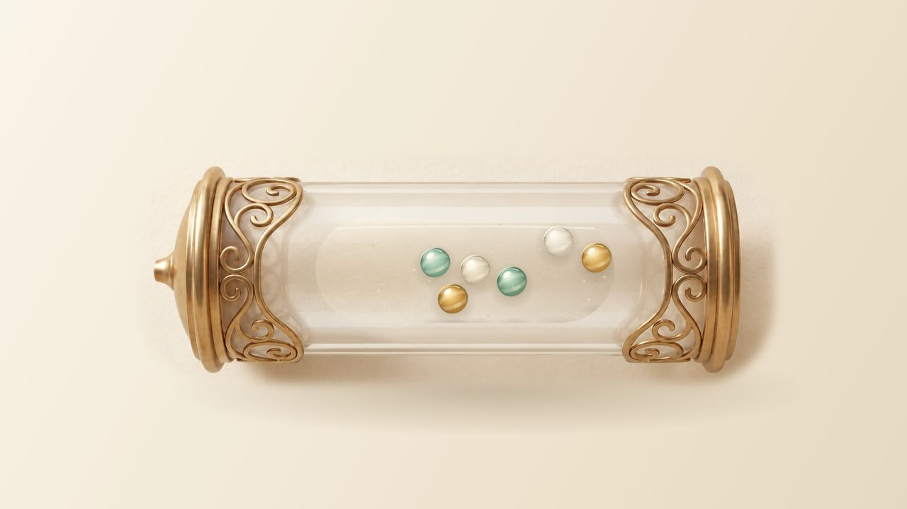

# 유리관 물리 셔플 검증

2026-10-07 · 대상 `/Users/proudchris/Desktop/moonbangoo_PinBall` · 구현 커밋 `237c500`.

## 확인한 원인과 수정

| 항목 | 기존 원인 | 이번 변경 |
| --- | --- | --- |
| 부유·반복 진동 | 각 핀볼의 phase를 사용한 x/y/z 사인파 힘이 지속적으로 에너지를 공급 | 기본 중력 + 유리관 전체의 짧은 공기압 펄스. 이후 관성·접촉 충격·벽 반사·마찰·감쇠로 이동 |
| 유리관 경계 | 물리 원통의 축 범위 ±3.2와 이미지의 내부 영역·클리핑이 서로 다른 기준 | 이미지 내부에서 도출한 캡슐 경계를 물리·표시·접촉 그림자에 공동 사용 |
| 핀볼 반지름 | 물리 반지름은 일정하지만 표시 반지름은 깊이에 따라 `.88 + z*.14`배 | 정면의 실제 접촉 거리와 표시 지름 일치. 기존 카메라 회전 중에는 같은 접촉 평면을 타원으로 투영 |
| 통과처럼 보이는 접촉 | 3D 깊이 충돌을 2D 사진 위에 작은 위치 이동만으로 표시하여 앞뒤 핀볼이 겹쳐 보임 | 유리관 셔플을 같은 평면의 실제 원 충돌로 정리. 임의 z 이동·크기 변화 제거 |
| 설정→시작 단절 | 대기용과 시작용 Chamber를 별도로 만들고 새 경기 Physics 생성 시 초기화 | 참가자 수·이름·ID가 같으면 같은 Chamber의 위치·속도를 그대로 인계 |

외부 엔진 교체 없이 기존 충돌 처리 구조를 사용했습니다. 유리관은 **2D 물리 단면**이며 입체 구체의 깊이 운동을 구현한 것은 아닙니다. 경기 엔진 `js/physics.js`, 대포 몸체 이미지와 전환, 바퀴 조립, 발사 카메라는 변경하지 않았습니다. 카메라 회전에서 핀볼 표시만 물리 접촉 평면에 맞추었습니다.

공기압은 약 1.65 물리 초마다 공통으로 작동합니다. 0.18초 충전 → 0.22초 압력 펄스 → 중력·관성·충돌·감속 순서입니다. 첫 시작 펄스는 기존 0.8초 블러가 사라진 뒤 보이도록 공급 시점을 맞췄습니다. 압력 밝기는 실제 공급 단계와 연결했습니다. 이 조절은 힘만 변경하며 핀볼 위치·속도를 초기화하지 않습니다.

120Hz 고정 물리 틱을 유지합니다. 이동 거리/반지름으로 2~4개의 세부 단계를 정하고, 접촉 오차에 따라 2~6회 보정합니다. 공간 해시의 접촉 후보를 재사용하여 500개 계산 비용을 줄였습니다. 참가자 변경으로 개수나 ID가 바뀌는 경우는 새 집합이 필요해 재생성합니다.

## 시드 정책

- 같은 시드·참가자·경기 설정에서 출발 슬롯 소유권은 별도의 시드 순열로 정합니다. 유리관 계산은 경기 RNG를 소비하지 않습니다.
- 대기 중 움직임은 실제로 이어지므로 대기 길이가 다르면 발사 직전의 화면 배치는 다를 수 있습니다. **대기 길이와 렌더 프레임 묶음은 출발 슬롯·최종 순위·도착 시간을 바꾸지 않습니다.**
- 현재 물리 셔플의 위치에서 출발하는 각 핀볼이 자신의 시드 슬롯으로 직접 날아갑니다. 눈에 보이는 핀볼 ID와 실제 출발 ID의 연결을 유지합니다. 현재 관 안의 순서는 짧은 발사 간격과 궤적 분산에 사용하며 슬롯 소유권을 재추첨하지 않습니다.
- 모션 감소는 현재 표시 위치를 동결하고 기존 짧은 전환을 사용합니다. 해제하면 현재 시점부터 다시 움직이며, 멈춘 시간을 한꺼번에 계산하지 않습니다. 경기 슬롯과 결과는 일반 모드와 같습니다.
- 재현성은 수정된 버전 안에서 보장합니다. 이전 버전과 동일 시드의 승자가 같다는 보장은 없습니다.

## 자동 검사

먼저 이전 커밋의 코드에서 개별 힘·중력·표시 지름·화면 전환 네 검사가 실패하는 것을 재현했습니다. [이전 버전 실패 로그](baseline-failures.txt).

실행: `node --test tests/*.test.cjs`. **77개 통과, 실패 0개**. 최신 [전체 검사 로그](full-tests.txt)를 참고하세요. 유리관 단독 실행은 `node --test tests/chamber-regression.test.cjs`입니다. [독립 성능 측정 로그](chamber-tests.txt)는 마지막 ID 완주 검사 추가 전 실행이며, 최종 전체 결과는 위 로그에 있습니다.

- 6·50·200·500개에서 실제 ID의 축 방향 순서 교환, 충돌 발생, 캡슐 안쪽 벽 준수, 접촉 거리 검사.
- 4 물리 초/480틱을 진행하고 12틱마다 모든 핀볼 쌍의 거리를 직접 검사. 대기 후 첫 공기압 재공급 조건도 별도 검사.
- 대기→설정→게임 시작의 같은 참가자 집합에서 위치·속도 그대로 인계. 시작 progress=0에서 상태 보존.
- 각 인원에서 대기 시간·프레임 묶음이 달라도 같은 시드의 슬롯 일치. 실제 경기 완주 ID·도착 시간도 대기 시간과 틱 묶음을 달리해 비교.
- 일반/모션 감소의 슬롯 일치, 대기 동결, 효과 해제 시 시간 점프 방지.
- 기존 발사 궤적·정확한 맵 진입·카메라·경기 충돌·500개 완주 검사 유지.

단독 실행에서 4초 셔플 및 거리 감사에 사용한 CPU 시간:

| 인원 | CPU 시간 | 기본 조건 최대 겹침/지름 | 대기 후 재가압 최대 겹침/지름 |
| --- | ---: | ---: | ---: |
| 6 | 11ms | 0.018% | 0.004% |
| 50 | 57ms | 1.043% | 0.672% |
| 200 | 346ms | 1.444% | 1.915% |
| 500 | 1472ms | 3.914% | 4.608% |

Node VM의 시뮬레이션+거리 감사 측정이며 브라우저 렌더링·GPU 비용은 포함하지 않습니다. 병렬 전체 검사에서는 다른 검사와 CPU를 공유하므로 시간이 더 길어집니다. 벽 관통은 검사에서 없었으나 **접촉 오차는 0이 아닙니다**. 500개에서 가장 큰 오차는 표시 지름의 약 4.61%이며, 데스크톱 정면에서는 약 0.35px입니다.

## 직접 브라우저 확인

Codex 인앱 브라우저에서 설정 입력과 시작 버튼을 직접 조작했습니다. 시드 `GLASS-QA-6/50/200/500`, 반경 11, 중력 620, 반발력 .72, 1배속, 최고 품질, 스킬 꺼짐.

| 화면 | 인원 | 확인 |
| --- | --- | --- |
| 데스크톱 1280×720 | 6·50·200·500 | 블러 해제 후 셔플, 벽·핀볼 접촉, 움직이는 집합의 위치 변경, 조립 단계로 이어짐 |
| 모바일 세로 390×844 | 6·50·200·500 | 같은 흐름과 경계·가림 확인, 인원별 캡처 |
| 모바일 가로 844×390 | 500 | 셔플·조립·발사, 대포와 맵을 같은 화면에서 확인 |
| 모바일 세로, 모션 감소 | 500 | 표시 동결과 짧은 시작 전환, 실제 경기 진입·완주 |

500개 일반 모드와 모션 감소 모드 모두 직접 완주했습니다. `GLASS-QA-500`의 마지막 도착은 **41.84초**, 표시된 첫 8명의 도착 시간은 두 실행에서 **14.71, 14.72, 14.92, 15.46, 15.80, 15.82, 15.87, 15.91초**로 같았습니다. 이름을 `참가자*500`으로 입력했으므로 화면의 이름만으로 개별 ID 재현성을 증명하지는 않습니다. ID 비교는 자동 검사에서 수행합니다. 경기 HUD의 관측 FPS는 75였고 콘솔 오류·경고는 없었습니다. 이는 이 컴퓨터의 인앱 브라우저 관측값입니다.

짧은 burst 단계의 자동 대기 도구가 순간을 놓친 경우에는 설정에서 다시 시작하고 셔플·조립 단계 캡처로 확인했습니다. 일부 발사 캡처는 추진력 발생 직전이며, 순간 발사의 전 구간을 기록한 영상은 아닙니다. 위치·속도 연속성의 수치 검증은 자동 검사이고, 캡처는 화면 구성·접촉 표시를 확인하는 증거입니다.

### 캡처

[6개 상승](desktop-6-burst.png) · [6개 관성 이동](desktop-6-settling.png) · [50개](desktop-50-burst.png) · [200개](desktop-200-burst.png) · [500개](desktop-500-burst.png)

[모바일 6개](mobile-6-burst.png) · [모바일 50개](mobile-50-mixing.png) · [모바일 200개](mobile-200-mixing.png) · [모바일 500개](mobile-500-mixing.png) · [500개 조립 진입](mobile-500-assembly.png)

[가로 화면](landscape-500-mixing.png) · [발사 구도](landscape-500-flight.png) · [일반 모드 500개 완주](mobile-500-complete.png) · [모션 감소 500개 완주](mobile-500-reduced-complete.png)

## 남은 한계와 로컬 상태

- 사진 에셋을 사용하는 2.5D 표현입니다. 실제 유리의 굴절, 3D 구체의 앞뒤 운동·가림·접촉 그림자를 정확히 재현하려면 유리관·핀볼의 3D 모델과 일관된 카메라가 필요합니다. 이번 단계에서는 몸체·바퀴·발사 카메라를 유지했습니다.
- 200·500개는 밀집 집합이며 특히 모바일에서 개별 핀볼이 매우 작습니다. 큰 핀볼 500개를 이 단면에 동시에 넣으면 심한 겹침이 생기므로 개수에 맞춰 반지름을 줄입니다.
- 저사양 실제 휴대폰에서의 FPS, iOS Safari/Android Chrome의 실기기 성능은 아직 확인하지 않았습니다. 모바일 검증은 실제 브라우저의 화면 크기 변경이며 휴대폰 CPU/GPU 에뮬레이션이 아닙니다.
- 기존 사용자 참가자 `귤*4,수박*2,키위*2`, 빈 시드, 일반 모션과 원래 슬라이더·품질·효과음 설정을 복원했습니다. 임시 뷰포트도 해제했습니다.
- 서버는 `http://127.0.0.1:8778/`에서 로컬 확인용으로 유지합니다. 푸시·배포하지 않았습니다.
